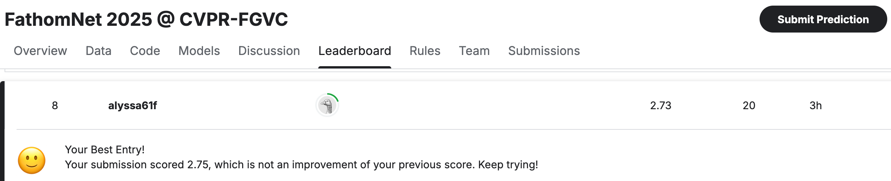

# Team 9 Final Project — CVPR-FGVC (FathomNet 2025)

**Competition**  
[FathomNet 2025 @ CVPR-FGVC (Kaggle)](https://www.kaggle.com/competitions/fathomnet-2025/overview)

## Leaderboard Snapshot

## How to Run Our Project (via Google Colab)

We have prepared a Google Colab notebook for easy evaluation.
No environment setup is required.
Please simply open the notebook below and run all cells:

[Click here to open Colab Notebook](https://colab.research.google.com/drive/1zyg3OnHDiae_81neJld1HViHgQxNogsz?usp=sharing)

The Colab notebook will automatically:

	1. Clone our GitHub repo.
	2. Download the fine-tuned DINOv2 model checkpoint (best_epoch.pth).
	3. Run inference on a small set (only 5) of test images (data/test/rois/).
	4. Generate a Kaggle-format submission CSV.

Example submission output:

## Advanced Algorithm

	Fine-tuned model: DINOv2 (facebook/dinov2-base)
	Final validation accuracy: 89.1%
	Final test score (avg taxonomic distance): 2.73
	Checkpoint: best_epoch.pth
	Inference script: infer.py
	Small test set (5 test ROIs) is provided under data/test/

## Note
    1. We also include the full CSV submission file submission_exp7_epoch23_30.csv in the GitHub repo.

    2. If you switch to the Resnet18 or Advanced_Approaches branches, you can view our full training codes and experimental scripts used during development.

## License

This project is released under the MIT License.
© 2025 CSE 5524 Team 9, The Ohio State University.
